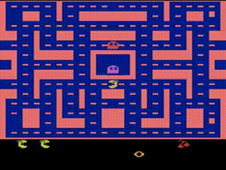

# Portfolio
## Reinforcement learning projects

### Playing Space Invaders with an actor-critic PPO algorithm
I have trained an actor-critic agent with a [Proximal policy optimization algorithm](https://arxiv.org/pdf/1707.06347.pdf) to play the Atari 2600 game Space Invaders using the reinforcement learning library [TF-Agents](https://www.tensorflow.org/agents). Using the [OpenAI Gym environment](https://gym.openai.com/envs/SpaceInvaders-ram-v0/),  the agent has been trained using as input the RAM of the Atari machine consisting of (only!) 128 bytes. In this environment what the agent "sees" is not the rendered image showing the space ships, projectiles and shields but just a sequence of 128 integer numbers corresponding to the RAM containing the stored information that represents the game state. The agent learns to consistently dodge projectiles and is able to complete the first level of the game.

### Playing MS-Pacman with a categorical DQN
I have trained a [Categorical Deep Q-Network ](https://arxiv.org/pdf/1707.06887.pdf) to play the Atari 2600 game MsPacman using the reinforcement learning library [TF-Agents](https://www.tensorflow.org/agents).   Using the [OpenAI Gym environment](https://gym.openai.com/envs/MsPacman-ram-v0/),  the agent has been trained using as input the RAM of the Atari machine consisting of (only!) 128 bytes. In this environment what the agent "sees" is not the rendered image showing the maze, dots, and ghosts but just a sequence of 128 integer numbers corresponding to the RAM containing the stored information that represents the game state. The agent learns to consistently navigate the maze and to chase the ghosts after having eaten the power pellets.

  
A high reward episode played by the trained agent

## Deep learning projects: Supervised learning 
### Vehicle motion prediction with 3d CNN 
I have trained a 3d convolutional neural network to predict the future trajectories of vehicles as an entry for the [Lyft Motion Prediction for Autonomous Vehicles](https://www.kaggle.com/c/lyft-motion-prediction-autonomous-vehicles) competition on Kaggle. The model takes as input few frames of bird's-eye view images containing the visual representation of all the vehicles in the scene and, through intermediate layers including also 3d convolutions (1 temporal+ 2 spatial dimensions), predicts 3 possible future trajectories for the target vehicle and associate a probability to each of them. The model easily outperforms the baseline benchmark set by the competition after being trained on approximately 10% of the training set. 

### Image segmentation to identify glomeruli in Kidney

I trained a [U-Net](https://arxiv.org/pdf/1505.04597.pdf) like architecture to predict segmentation masks in order to identify glomeruli inspired by the task of the [HuBMAP - Hacking the Kidney](https://www.kaggle.com/c/hubmap-kidney-segmentation) competition on Kaggle. The model adds an attention mechanism to the U-Net through the use of the [Convolutional Block Attention Module](https://arxiv.org/pdf/1807.06521.pdf). The model was trained using Kaggle's free TPU quota. 

